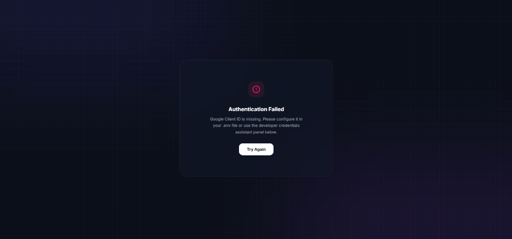
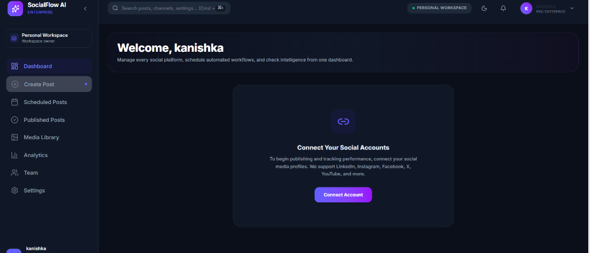
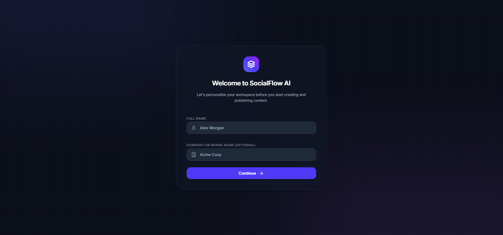
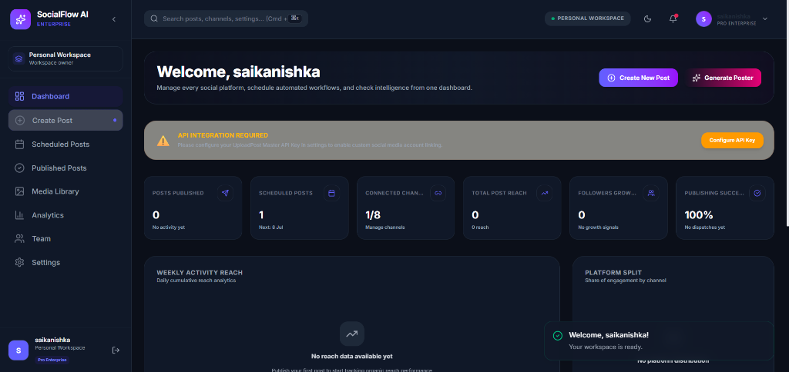

# 🚀 SocialFlow AI

SocialFlow AI is a high-performance, single-dashboard workspace that automates content publishing and scheduling across major social media channels. Designed with a dark glassmorphic theme and powered by an automated backend integration, it bridges the gap between manual draft creation and direct platform dispatches.

---

## 🖼️ Hero Image



---

## Problem Statement

In today's digital world, businesses, startups, and content creators need to publish engaging content across multiple social media platforms to stay connected with their audience. However, creating high-quality content involves using multiple tools for writing captions, designing promotional creatives, storing media, and manually publishing posts.

This fragmented workflow is time-consuming, repetitive, and inefficient, leading to reduced productivity and inconsistent branding. Small businesses and individual creators often lack affordable tools that combine AI-powered content creation with automated publishing in a single platform.

---

## Solution

SocialFlow AI is an AI-powered social media content creation and publishing platform that streamlines the entire content workflow from one place.

Users can upload a promotional video or generate marketing creatives using AI by simply describing what they want. The platform also generates engaging captions and relevant hashtags using AI, allowing users to review and edit the content before publishing.

When the user clicks Publish, the request is sent to an n8n workflow that automates the publishing process.

The workflow performs the following steps:

Receives the request through a webhook.
Uploads the media (video, and images if supported) to Cloudinary.
Uses an AI model to generate optimized captions and hashtags.
Combines the generated content with the uploaded media.
Publishes the content to the selected social media platform(s).
Returns the publishing status to the application.

By combining AI-powered content generation with workflow automation, SocialFlow AI enables users to create professional social media content and publish it more efficiently from a single platform.


## Objectives
Simplify social media content creation.
Reduce manual effort in publishing.
Generate AI-powered captions and hashtags.
Generate marketing posters using AI.
Automate publishing through n8n.
Provide a unified platform for creators and businesses.

---

## ✨ Key Features
🤖 AI Caption Generation

Generate engaging captions from a simple prompt.

🎨 AI Image Generation

Create marketing posters, promotional banners, and social media creatives from text prompts.

🏷 AI Hashtag Generation

Generate platform-relevant hashtags automatically.

🎥 Video Upload

Upload promotional videos for publishing.

👀 Content Preview

Review and edit generated content before publishing.

🚀 Automated Publishing

Publish content through an n8n-powered workflow.

📋 Recent Posts Dashboard

View previously published posts and their status.
---

## How SocialFlow AI differs

• AI-first content creation
Most social media management tools focus on scheduling and analytics. SocialFlow AI helps users create content by generating captions, hashtags, and marketing creatives with AI before publishing.

• Unified workflow
Instead of switching between AI writing tools, design tools, cloud storage, and social media platforms, users can perform the entire workflow in one application.

• Workflow automation with n8n
Publishing is powered by an n8n automation workflow, making the process modular and easy to extend with additional integrations and automations.

• Simplified user experience
The platform is designed with a straightforward workflow: create content, preview it, and publish it, making it approachable for small businesses and creators.

• AI-generated marketing creatives
Users can generate promotional posters from text prompts, reducing the need to use a separate design tool for basic marketing content.

• Open and customizable architecture
Because the backend uses n8n workflows, developers can customize and extend the publishing process with additional services or business-specific automations.

## 🛠️ Tech Stack

- **Frontend Core**: React 18, Vite, JavaScript
- **Styling**: TailwindCSS, Vanilla CSS, Framer Motion (micro-animations)
- **Icons**: Lucide Icons
- **Image Generation**: Pollinations.ai CDN
- **Database/Storage**: Supabase / Browser localStorage
- **Pipeline Automation**: n8n workflow engine
- **Hosting**: Netlify

---

## 📊 Architecture Diagram

                    ┌──────────────────────┐
                    │    React + Vite UI   │
                    └──────────┬───────────┘
                               │
                               ▼
                    ┌──────────────────────┐
                    │    HTTP Webhook      │
                    └──────────┬───────────┘
                               │
                               ▼
                    ┌──────────────────────┐
                    │     n8n Workflow     │
                    └──────────┬───────────┘
                               │
                               ▼
                    ┌──────────────────────┐
                    │  Upload to Cloudinary│
                    └──────────┬───────────┘
                               │
                               ▼
                    ┌──────────────────────┐
                    │ OpenAI / Gemini AI   │
                    │ Caption + Hashtags   │
                    └──────────┬───────────┘
                               │
                               ▼
                    ┌──────────────────────┐
                    │ Merge Media + Caption│
                    └──────────┬───────────┘
                               │
                               ▼
                    ┌──────────────────────┐
                    │ Upload Video Node    │
                    │ (Social Platform)    │
                    └──────────┬───────────┘
                               │
                               ▼
                    ┌──────────────────────┐
                    │ Publish Status       │
                    └──────────┬───────────┘
                               │
                               ▼
                    ┌──────────────────────┐
                    │ React Frontend       │
                    └──────────────────────┘
---

## 🔄 Workflow

                    ┌──────────────────────┐             
                    │         User         │
                    └──────────┬───────────┘
                               │
                               ▼
                    ┌──────────────────────┐
                    │   Create New Post    │
                    └──────────┬───────────┘
                               │
                ┌──────────────┴──────────────┐
                │                             │
                ▼                             ▼
      ┌──────────────────┐         ┌──────────────────┐
      │   Upload Video   │         │ Generate AI Image│
      └────────┬─────────┘         └────────┬─────────┘
               │                            │
               └────────────┬───────────────┘
                            │
                            ▼
                 ┌──────────────────────┐
                 │     Enter Prompt     │
                 └──────────┬───────────┘
                            │
                            ▼
                 ┌──────────────────────┐
                 │ AI Generate Caption  │
                 └──────────┬───────────┘
                            │
                            ▼
                 ┌──────────────────────┐
                 │AI Generate Hashtags  │
                 └──────────┬───────────┘
                            │
                            ▼
                 ┌──────────────────────┐
                 │    Preview Content   │
                 └──────────┬───────────┘
                            │
                            ▼
                 ┌──────────────────────┐
                 │       Publish        │
                 └──────────┬───────────┘
                            │
                            ▼
                 ┌──────────────────────┐
                 │    HTTP Webhook      │
                 └──────────┬───────────┘
                            │
                            ▼
                 ┌──────────────────────┐
                 │     n8n Workflow     │
                 └──────────┬───────────┘
                            │
                            ▼
                 ┌──────────────────────┐
                 │ Upload to Cloudinary │
                 └──────────┬───────────┘
                            │
                            ▼
                 ┌──────────────────────┐
                 │ OpenAI / Gemini AI   │
                 │ Caption + Hashtags   │
                 └──────────┬───────────┘
                            │
                            ▼
                 ┌──────────────────────┐
                 │ Merge Media + Caption│
                 └──────────┬───────────┘
                            │
                            ▼
                 ┌──────────────────────┐
                 │ Upload Video / Image │
                 │  Social Media Node   │
                 └──────────┬───────────┘
                            │
                            ▼
                 ┌──────────────────────┐
                 │ Publish Status       │
                 └──────────┬───────────┘
                            │
                            ▼
                 ┌──────────────────────┐
                 │ React + Vite UI      │
                 └──────────────────────┘

## 📸 Screenshots

### 1. Welcome Onboarding


### 2. Main Dashboard


### 3. AI Poster Generator



---

## 🎥 Demo Video

Watch the walkthrough of the application in action:
* 🎬 **[Watch SocialFlow AI Demo Video](https://drive.google.com/file/d/1UiSXZ1Q7aRRKedvDvFKi9FN9utBREMXe/view?usp=drivesdk)**

---

## ⚙️ Installation

To set up the development server locally:

1. **Clone the repository**:
   ```bash
   git clone https://github.com/kanishka2610-web/socialflowai.git
   cd socialflowai
   ```

2. **Install dependencies**:
   ```bash
   npm install
   ```

3. **Start the Vite development server**:
   ```bash
   npm run dev
   ```
   Open `http://localhost:5173/` in your browser.

4. **Build production assets**:
   ```bash
   npm run build
   ```

---

## 📁 Project Structure

```
SocialFlow-AI/
│
├── README.md                    # Main project documentation
├── LICENSE                      # MIT license file
├── .gitignore                   # Untracked files configuration
├── package.json                 # Dependency manifests
├── package-lock.json            # Fixed dependency versions lock
├── netlify.toml                 # Netlify Single Page Application redirects
│
├── public/                      # Static assets and icons
│
├── src/
│   ├── assets/                  # Frontend graphic assets
│   ├── components/              # UI widgets and layouts
│   │   ├── Navbar.jsx
│   │   ├── Sidebar.jsx
│   │   ├── Onboarding.jsx
│   │   └── PosterGenerator.jsx
│   │
│   ├── context/
│   │   └── AppContext.jsx       # State management & webhooks
│   │
│   ├── views/                   # Panel views
│   │   ├── Dashboard.jsx
│   │   ├── CreatePost.jsx
│   │   ├── PublishedPosts.jsx
│   │   ├── ScheduledPosts.jsx
│   │   └── Profile.jsx
│   │
│   ├── App.jsx                  # Main router entry point
│   ├── main.jsx                 # Render root
│   └── index.css                # Base Tailwind classes
│
├── n8n/
│   └── socialflow-workflow.json # n8n workflow configuration export
│
└── docs/                        # Architectural specifications
    ├── architecture.md
    ├── workflow.md
    └── api.md
```

---

## 🔗 n8n Workflow

The automation workflow integrates directly with your self-hosted n8n platform. 



1. **JSON Payload Import**: Load the workflow schema directly into your editor using the JSON export file:
   📄 [socialflow-workflow.json](n8n/socialflow-workflow.json)
2. **Setup Trigger**: Configure your webhook node path to listen on:
   `https://kanishkaparuchuri.app.n8n.cloud/webhook/a938f841-0d71-4c98-aa06-31d533a11c73`
3. **Execution Delay**: The webhook handler inspects the incoming `scheduleTime` field to trigger an n8n Wait node, matching post dispatches to the exact minute.

---

## 🔮 Future Scope

- **Direct OAuth Integrations**: Provide optional direct accounts linking (LinkedIn API, X API, etc.) for customized posting controls.
- **Multimodal Video Generation**: Extend the Poster Generator to output dynamic MP4 reels and short videos.
- **Analytics Sync Pipelines**: Poll platform dispatches to display engagement rate trends, follower counts, and CTR metrics.

---
##
👥 Target Users
Small Businesses
Startups
Digital Marketing Agencies
Content Creators
Freelancers
Social Media Managers

## Future Scope
Native image publishing (if not in the MVP)
Content scheduling
Brand Kit and reusable templates
Multi-user collaboration
Analytics dashboard
AI content calendar

##
🎤 One-Line Pitch

SocialFlow AI is an AI-powered social media content creation and publishing platform that helps businesses and creators generate marketing creatives, captions, and hashtags with AI, then automate publishing through n8n from a single, easy-to-use interface.


## 👥 Team Members

- **kanishka** - UI designing & N8N Workflow Management
- **Thanish** -  Research & Developement
- **Venkata Hemanth** - UI desingning
---

## 📄 License

This project is licensed under the MIT License - see the [LICENSE](LICENSE) file for details.
