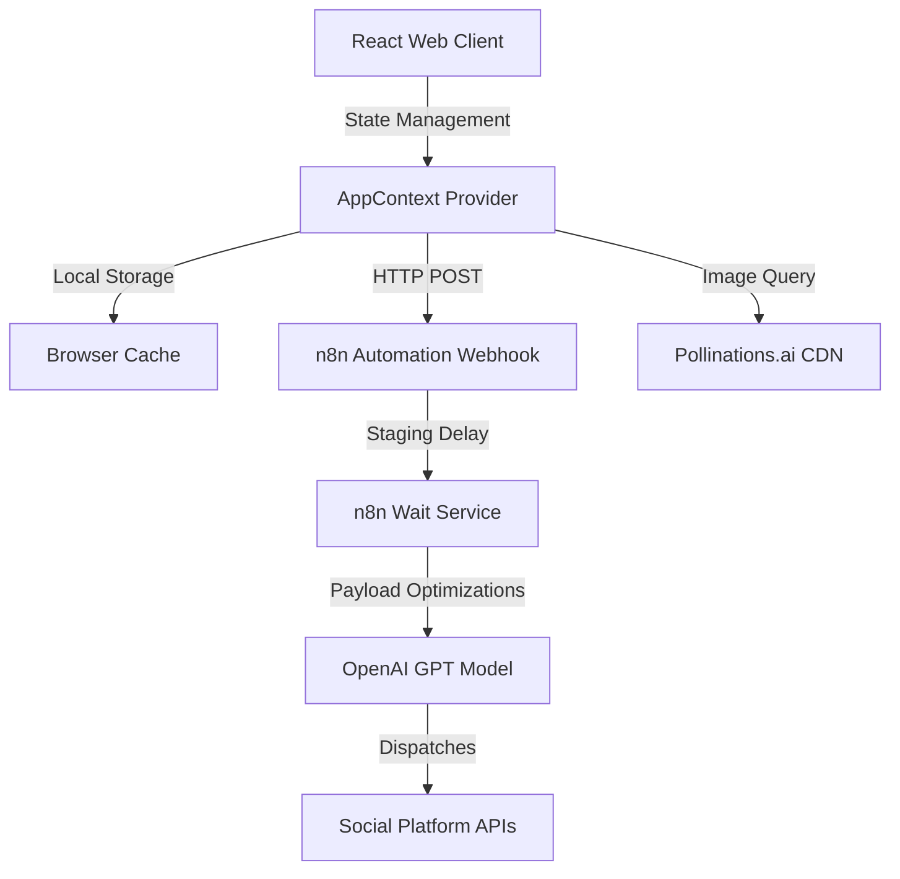
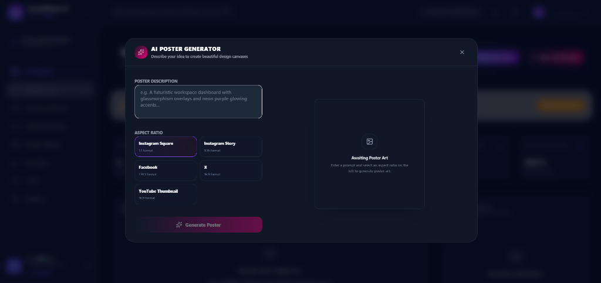

# 🚀 SocialFlow AI

SocialFlow AI is a high-performance, single-dashboard workspace that automates content publishing and scheduling across major social media channels. Designed with a dark glassmorphic theme and powered by an automated backend integration, it bridges the gap between manual draft creation and direct platform dispatches.

---

## 🖼️ Hero Image


---

## 🎯 Problem Statement

Modern social media management tools are often cluttered, expensive, and require complex configuration, oauth redirect loops, and manual logins. Content creators, marketing teams, and small brands require an immediate, authentication-free dashboard that is lightweight, allows instant image generation, and publishes or schedules post payloads seamlessly across platforms without leaving the workspace.

---

## 💡 Solution

SocialFlow AI simplifies social media management by offering:
- **Instant Passwordless Onboarding**: Enter your name and brand name to immediately provision an active workspace.
- **Multistep Post Composer**: Walk through title generation, copy rewriting via AI tools, custom media attachment, and real-time previews.
- **AI Poster Generator**: Generate gorgeous graphics inside the composer using Pollinations.ai with selectable aspect-ratio mapping.
- **Direct Automation Integration**: Fires structured JSON payloads directly to an n8n webhook, allowing off-loaded background scheduling and cross-posting.
- **Ultra-Premium UI**: Fully responsive dark theme with sleek violet-to-magenta gradient accent controls.

---

## ✨ Features

1. **Email-less Onboarding**: Start managing workspaces without entering credentials.
2. **Publish Now vs. Schedule Later**: Flexible publish triggers with automated ISO 8601 formatting and timezone calculation.
3. **AI Content Helpers**: Rewrite, improve, and generate caption copies.
4. **AI Poster Engine**: High-fidelity text-to-image generator with square, horizontal, and vertical ratio bounds.
5. **Interactive Phone Mockup Frame**: Displays post feeds inside a smartphone mock border (complete with home indicator, notch, and status bar) to review look and feel before dispatching.
6. **Deployable and Ready**: Optimized SPA redirects ready for immediate deployment on Netlify.

---

## 🛠️ Tech Stack

- **Frontend Core**: React 18, Vite, JavaScript
- **Styling**: TailwindCSS, Vanilla CSS, Framer Motion (micro-animations)
- **Icons**: Lucide Icons
- **Image Generation**: Pollinations.ai CDN
- **Database/Storage**: Supabase / Browser localStorage
- **Pipeline Automation**: n8n workflow engine
- **Hosting**: Netlify

---

## 📊 Architecture Diagram

For a detailed view, see [docs/architecture.md](docs/architecture.md).



---

## 📸 Screenshots

### 1. Welcome Onboarding


### 2. Main Dashboard


### 3. AI Poster Generator


### 4. Create Post Wizard (Preview)


---

## 🎥 Demo Video

Watch the walkthrough of the application in action:
* 🎬 **[Watch SocialFlow AI Demo Video](https://drive.google.com/file/d/1UiSXZ1Q7aRRKedvDvFKi9FN9utBREMXe/view?usp=drivesdk)**

---

## ⚙️ Installation

To set up the development server locally:

1. **Clone the repository**:
   ```bash
   git clone https://github.com/kanishka2610-web/socialflowai.git
   cd socialflowai
   ```

2. **Install dependencies**:
   ```bash
   npm install
   ```

3. **Start the Vite development server**:
   ```bash
   npm run dev
   ```
   Open `http://localhost:5173/` in your browser.

4. **Build production assets**:
   ```bash
   npm run build
   ```

---

## 📁 Project Structure

```
SocialFlow-AI/
│
├── README.md                    # Main project documentation
├── LICENSE                      # MIT license file
├── .gitignore                   # Untracked files configuration
├── package.json                 # Dependency manifests
├── package-lock.json            # Fixed dependency versions lock
├── netlify.toml                 # Netlify Single Page Application redirects
│
├── public/                      # Static assets and icons
│
├── src/
│   ├── assets/                  # Frontend graphic assets
│   ├── components/              # UI widgets and layouts
│   │   ├── Navbar.jsx
│   │   ├── Sidebar.jsx
│   │   ├── Onboarding.jsx
│   │   └── PosterGenerator.jsx
│   │
│   ├── context/
│   │   └── AppContext.jsx       # State management & webhooks
│   │
│   ├── views/                   # Panel views
│   │   ├── Dashboard.jsx
│   │   ├── CreatePost.jsx
│   │   ├── PublishedPosts.jsx
│   │   ├── ScheduledPosts.jsx
│   │   └── Profile.jsx
│   │
│   ├── App.jsx                  # Main router entry point
│   ├── main.jsx                 # Render root
│   └── index.css                # Base Tailwind classes
│
├── n8n/
│   └── socialflow-workflow.json # n8n workflow configuration export
│
└── docs/                        # Architectural specifications
    ├── architecture.md
    ├── workflow.md
    └── api.md
```

---

## 🔗 n8n Workflow

The automation workflow integrates directly with your self-hosted n8n platform. 


1. **JSON Payload Import**: Load the workflow schema directly into your editor using the JSON export file:
   📄 [socialflow-workflow.json](n8n/socialflow-workflow.json)
2. **Setup Trigger**: Configure your webhook node path to listen on:
   `https://saikanishka.app.n8n.cloud/webhook/a938f841-0d71-4c98-aa06-31d533a11c73`
3. **Execution Delay**: The webhook handler inspects the incoming `scheduleTime` field to trigger an n8n Wait node, matching post dispatches to the exact minute.

---

## 🔮 Future Scope

- **Direct OAuth Integrations**: Provide optional direct accounts linking (LinkedIn API, X API, etc.) for customized posting controls.
- **Multimodal Video Generation**: Extend the Poster Generator to output dynamic MP4 reels and short videos.
- **Analytics Sync Pipelines**: Poll platform dispatches to display engagement rate trends, follower counts, and CTR metrics.

---

## 👥 Team Members

- **kanishka** - Lead Developer & Systems Integrator

---

## 📄 License

This project is licensed under the MIT License - see the [LICENSE](LICENSE) file for details.
