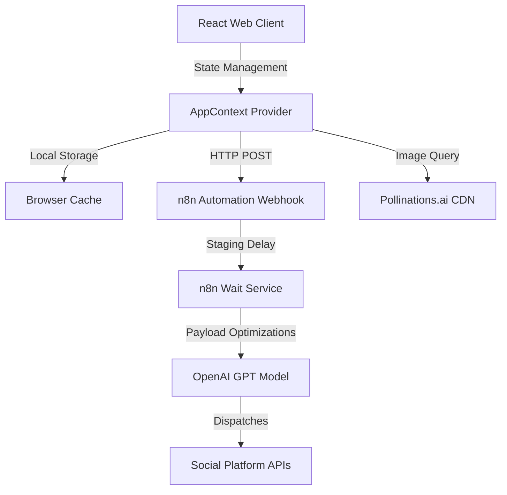

# SocialFlow AI - System Architecture

SocialFlow AI is designed as a lightweight, modern social media management tool. It decouples the rich post-composer interface from the publishing and scheduling automation pipeline.

## System Components

1. **Vite React Frontend**:
   - Built on React 18, Vite, TailwindCSS, and Lucide icons.
   - Self-contained routing via simple layout page states.
   - Interactive multistep wizard (`CreatePost.jsx`) supporting draft creation, scheduling options, and rich feed preview mockups.

2. **AppContext Context Provider**:
   - Manages state across all pages (active view, draft listings, scheduled lists, settings config).
   - Resolves mock analytics and syncs connected social channels.
   - Fires JSON payload dispatches to the n8n automation engine.

3. **n8n Webhook Listener**:
   - Production entry URL listening for dispatches:
     `https://saikanishka.app.n8n.cloud/webhook/a938f841-0d71-4c98-aa06-31d533a11c73`
   - Parses the JSON schema containing target scheduled times, channel list, and attached media assets.

4. **Pollinations.ai Image Service**:
   - Fully client-side image generator loaded directly into the `PosterGenerator.jsx` canvas component.
   - Translates aspect-ratios to custom dimensions and renders via standard image loads.
